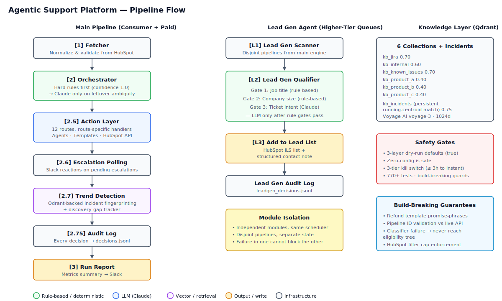

# 🤖 Agentic Support Platform — v1

> An end-to-end AI pipeline that automatically triages, researches, and responds to incoming support tickets — with full audit trails, human-in-the-loop escalation, and proactive incident detection.

---

> **About this repo.** This is an architecture writeup for a production multi-agent platform I designed and built. The full source is private; this repo documents the system's design, the architectural decisions behind it, and the engineering tradeoffs that shaped it. Code samples and walkthroughs are available on request.

---

## What This Is

A production-grade multi-agent AI system designed to process tickets from HubSpot queues. It classifies intent, applies hard business rules, routes tickets to the right handler, executes automated actions (replies, notes, escalations), and surfaces trends and incidents to the support team — all with a structured audit log on every decision.

**v1 is feature-complete and operating against multi-tier queues.** 12 active routes (including a scripted refund agent and a business-needs auto-router to a higher-tier queue), 6 knowledge bases with source-classified retrieval, Slack-based human-in-the-loop triage, Qdrant-backed incident fingerprinting, per-ticket cost observability, an 8-page real-time dashboard with a self-serve Known Issues submission form, and a weekly intelligence brief that pushes what's trending without forcing anyone to open the dashboard.

Multi-tier rollout is gated behind an env-var flag (`AI_ELIGIBLE_PIPELINES`) — narrowing the scope back to a single tier is one line in the shell config, no redeploy.

---

## Architecture



```
HubSpot (Consumer + Paid Queues)            HubSpot (Higher-Tier Queues)
        │                                                  │
        ▼                                                  ▼
  [1] Fetcher ──────────── Normalize & validate     [L1] Lead Gen Scanner
        │                                                  │
        ▼                                                  ▼
  [2] Orchestrator ─────── Hard rules → Claude       [L2] Lead Gen Qualifier
        │                                                  ├── title gate (rule)
        ▼                                                  ├── company-size gate (rule)
  [2.5] Action Layer ───── Route-specific handlers       └── intent gate (Claude)
        │         │          │                              │
        ▼         ▼          ▼                              ▼
    Agents    Templates   HubSpot API              [L3] Add to lead list +
   (Claude)   (Canned)    (REST)                       structured contact note
        │
        ▼
  [2.6] Escalation Polling ─────── Check Slack reactions on pending escalations
        │
        ▼
  [2.7] Trend Detection ───────── Incident detector (kb_incidents) + Discovery gaps
        │
        ▼
  [2.75] Audit Log ────────────── Append every decision to decisions.jsonl
        │
        ▼
  [3] Run Report ──────────────── Metrics summary → Slack
```

Every ticket that enters the pipeline exits with a logged decision. No silent failures.

The main pipeline (`main.py --live`) and the Lead Gen Agent (`python -m leadgen`) are **independent modules** invoked side-by-side by `run.sh` and `scheduler.py`. They scan disjoint sets of HubSpot pipelines (main = consumer + paid; lead gen = higher-tier queues) and have separate state files, dedup, and audit logs — failure in one does not block the other.

> **Deeper dive:** [ARCHITECTURE.md](./ARCHITECTURE.md) covers the seven design decisions I'd most want to discuss in an interview — hard-rule pre-gates, build-breaking tests, match-first incident detection, threshold tuning as operational discipline, module isolation, safe-by-default kill switches, and audit-log-driven debugging.

---

## Active Routes (v1)

| Route | What Happens |
|-------|-------------|
| `how_to_questions` | Retrieves KB chunks, generates customer-facing reply, sends email → moves ticket to Waiting-on-Contact + bot owner |
| `support` | Researches across 4 KBs (incl. dashboard-submitted known issues), posts structured internal note. **Exempt** from the email-sent rule — note-only, `ai_handled=Yes`, no owner, no stage change |
| `feature_requests` | Logs to JSONL, sends product-specific acknowledgment email → Waiting-on-Contact + bot owner |
| `student_activation` | Sends activation instructions email → Waiting-on-Contact + bot owner |
| `student_upgrade` | Moves ticket to paid pipeline |
| `active_trial` | Moves to paid pipeline, posts note, skips AI |
| `spam` | Silent close — no customer email |
| `human_escalation` | Posts to a triage Slack channel with full context for reaction-based triage. Paid-tier tickets get `ai_handled=Yes` written at post time (stage stays at NEW, no owner) |
| `business_needs_routing` | **Auto-routes to higher-tier queue.** Fires for high-tier accounts, top-band ARR, named business-needs owner, or high-value trial + sales rep. Moves ticket, flags `ai_handled=Yes`, posts informational Slack alert (no reactions). No agent runs. |
| `billing` | Quiet handoff — posts internal note with AI classification, tags ticket type, leaves for human agent (no customer email, no Slack escalation) |
| `account_access` | Quiet handoff — same as `billing` with `Account Management` ticket type |
| `refund` | Two-stage agent (LLM intent classifier → deterministic eligibility tree), routed by HubSpot pipeline ID. See **Refund Agent** below. |

Fully autonomous billing and account-access responses are deferred to v2 (they depend on additional API integrations). In v1 these routes are still classified, tagged, and logged — they just don't generate customer-facing replies.

---

## Hard Business Rules

Business rules run **before Claude ever sees a ticket** — guaranteed routing with confidence 1.0, no AI involved, no hallucination risk. Tier / ARR / named-owner / trial-rep signals auto-route straight to the higher-tier queue. Only health-score escalations still hit the thumbsup/thumbsdown approval flow.

| Rule | Trigger | Outcome |
|------|---------|---------|
| Refund pipeline | `hs_pipeline == REFUND_PIPELINE_ID` | `refund` — dispatched to the refund agent |
| Active trial license | Trial-tier license types | `active_trial` |
| High-tier account | Account tier match | **`business_needs_routing`** — auto-move + informational Slack alert |
| High-value account | ARR flag in top bands | **`business_needs_routing`** |
| Named business-needs owner | Org owner ∈ `BUSINESS_NEEDS_OWNER_IDS` | **`business_needs_routing`** |
| High-value trial with sales rep | `high_value_trial` + `assigned_sales_rep` | **`business_needs_routing`** |
| Churn risk | Health score ≤ 30 | `human_escalation` — stays in the reaction-approval flow (genuine human-judgement call) |

This layer ensures your highest-risk tickets never touch automation without a human first, and routes high-touch accounts to the queue their account team already watches.

---

## Knowledge Bases

Six Qdrant collections back the AI agents, each tuned to its source:

| Collection | Source | Score Threshold |
|-----------|--------|----------------|
| `kb_jira` | Jira CSV export | 0.70 — tuned down from 0.85 after live calibration |
| `kb_internal` | Internal docs export | 0.60 — broader for workarounds |
| `kb_known_issues` | **Dashboard Known Issues page** — one-off bug submissions | 0.70 (matches Jira tier). Gated by `KNOWN_ISSUES_RETRIEVAL_ENABLED`; submissions accumulate in Qdrant whether the flag is on or off. See **Known Issues** below. |
| `kb_product_a` | Public help docs | 0.40 |
| `kb_product_b` | Public help docs | 0.40 |
| `kb_product_c` | Public help docs | 0.40 |

Plus one more Qdrant collection that isn't a retrieval source but serves the same embedding stack:

| Collection | Purpose | Threshold |
|---|---|---|
| `kb_incidents` | Persistent incident fingerprints — tickets match into existing incidents via running-centroid embeddings. Powers the Qdrant-backed incident detector. | 0.75 — lowered from 0.85 after clustering data showed genuine clusters embed at 0.75-0.85 |

**Embedding model:** Voyage AI `voyage-3` (1024 dimensions)
**Vector DB:** Qdrant running in Docker

The threshold spread is intentional — Jira matches and dashboard-submitted known issues need high confidence because a wrong reference undermines agent credibility. Internal docs and help articles can cast a wider net.

---

## AI Agents

### How-To Agent
Answers usage questions using retrieved KB chunks and sends the reply directly to the customer.

- **Respond** (confidence ≥ 0.7) — sends answer with citations from help articles
- **Escalate** — no matching articles found, routes to human
- **Reroute** — misclassified ticket (e.g. actually a feature request)

### Support Agent *(v1: Internal Notes)*
Researches bug reports and technical issues across up to four knowledge sources concurrently, then produces a structured internal HubSpot note for the human agent picking it up.

Knowledge retrieval runs in parallel:
1. `kb_known_issues` — dashboard-submitted bugs (threshold 0.70, gated by `KNOWN_ISSUES_RETRIEVAL_ENABLED`)
2. `kb_jira` — open known issues from Jira CSV (threshold 0.70)
3. `kb_internal` — internal workarounds (threshold 0.60)
4. `kb_<product>` — public help docs (threshold 0.40)

**Every internal note includes:**
- Dashboard-submitted known issues first (curated ground truth outranks Jira-CSV on the same ticket)
- Jira issue matches with key, summary, status, priority, confidence score, and URL
- Workarounds from internal documentation
- Relevant help articles
- Trend signal if a pattern has been detected
- Knowledge gap flag if no documentation exists for a real issue
- 1–2 sentence analyst recommendation

**Exempt from the email-sent rule.** Because the support agent only produces an internal note (v1), it doesn't claim ownership and doesn't move the stage. The ticket gets `ai_handled=Yes` so reporting counts it, and the note is posted — that's it. Humans pick the ticket up from wherever it already sits.

Customer-facing replies from the Support Agent are deferred to v2 — v1 keeps a human in the response loop for bug reports.

### Feature Request Handler
Logs structured feature request entries to `feature_requests.jsonl`, posts an internal HubSpot note, and sends a product-specific acknowledgment email with a sanitized feature summary. The `feature_summary` field is validated against empty and malformed states before reaching the email template — no raw user input hits the customer-facing message.

---

## Refund Agent

Scripted two-stage agent (no LLM for the eligibility decision — compliance-sensitive logic is rule-based and reproducible). Handles tickets landing in the refund HubSpot pipeline.

**Stage 1 — Intent classification (LLM)**
Some customers pick "refund" on the ticket form even when they're asking something else. A binary classifier reads subject + body and returns `is_refund / confidence / reasoning`. Misfiles route to Customer Success without ever reaching the eligibility tree.

**Stage 2 — Deterministic eligibility (pure function)**
Maps `(account_tier, subscription_start_date, reseller_domains)` to one of six outcomes:

| Tier | Window | Reseller? | Outcome |
|------|--------|-----------|---------|
| paid tier | ≤ 6 days | no | `ELIGIBLE` — send eligible template |
| paid tier | = 7 days (boundary) | no | `AMBIGUOUS_NO_START_DATE` — hybrid template |
| paid tier | ≥ 8 days | no | `DENIED_WINDOW` — denied template |
| paid tier | missing | no | `AMBIGUOUS_NO_START_DATE` — hybrid template |
| higher tiers | any | any | `ROUTE_TO_CUSTOMER_SUCCESS` |
| any | any | yes | `RESELLER_BLOCK` — route to CS |
| missing account_type | any | any | `HUMAN_ESCALATION` |

The self-serve refund flow is the authoritative cutoff — the template never promises a refund, only qualifies the request. A build-breaking lint test (`TestRefundTemplateGuardrails`) fails if any template contains `"refund approved"`, `"refund issued"`, `"we have refunded"`, etc.

**Three dry-run gates** layer in front of all HubSpot writes — see **Safety Gates & Kill Switches** below.

**Audit log:** every decision (intent classification + eligibility result + action taken) appends to `refund_decisions.jsonl` with full context for the Refunds dashboard page.

---

## Lead Gen Agent

A separate subpackage at `support-ticket-engine/leadgen/` that scans the **higher-tier** HubSpot pipelines for tickets representing high-value sales-qualifiable contacts. Runs alongside the main pipeline on the same 3h cron via `run.sh` and `scheduler.py`, but is otherwise an independent module — own state, own dedup, own logs.

The pipelines lead gen scans are deliberately **disjoint** from the main pipeline's `AI_ELIGIBLE_PIPELINES`. The main engine handles support traffic; lead gen pulls qualified leads out of higher-tier queues without touching how those tickets are worked.

### Three-gate qualification

Rule-based gates run first so Claude only sees tickets that are already worth classifying — keeps token spend bounded.

| Gate | Type | Pass condition |
|---|---|---|
| **Job title** | Rule-based | Contact's `job_title_level` ∈ `{manager, director, vp, c-level, owner, partner, founder}` *or* `jobtitle` matches a manager-plus keyword (CTO, head of, team lead, principal, etc.) |
| **Company size** | Rule-based | Company has ≥ 150 employees *or* ≥ 30 developers — falls back to `hs_employee_range` band when explicit count is missing (`51 - 200` and up pass) |
| **Ticket intent** | Claude (`claude-sonnet-4-5`) | Classifier returns `billing` or `admin`. Other intents (technical, feature_request, how_to, other) drop the lead. Only fires after both rule gates pass. |

A separate denylist filters out internal teammates by name (loaded from the HubSpot Owners API) so internal test tickets don't leak into the lead list.

### Output

Tickets that pass all three gates get:

1. The contact added to a HubSpot ILS list — uses the **ILS Segment ID**, not the legacy v1 list ID (the v3 Lists API 404s on the legacy form)
2. A structured note created on the contact with the qualifying reason, ticket subject preview, and intent classification

### State + dedup

- `logs/leadgen_decisions.jsonl` — every qualification decision (pass + drops with reason), audit-grade
- `logs/leadgen_processed_ids.json` — ticket-id dedup, 90-day retention so a ticket that re-opens after months gets re-evaluated
- `logs/.leadgen_last_run` — incremental cursor; `--full` ignores it for a from-scratch sweep

### CLI

```bash
cd support-ticket-engine
python -m leadgen                       # incremental scan (default — what cron runs)
python -m leadgen --full                # full scan, ignore .last_run cursor
python -m leadgen --ticket <ticket_id>  # single-ticket evaluation
python -m leadgen --dry-run             # qualify without writing to HubSpot
python -m leadgen --dry-run --json out.json  # export results for review
```

Lead gen has its own preflight checks (`python -m leadgen.preflight`) and standalone tools — `find_list.py` for resolving the ILS Segment ID against the live HubSpot list, `monthly_stats.py` for rollups, `probe_email_scope.py` and `debug_batch_read.py` for HubSpot API debugging.

---

## Safety Gates & Kill Switches

Every side-effecting subsystem is gated by an env-var dry-run flag that **defaults to `true`** — running the pipeline cannot touch a customer without someone opting in. All three default-safe flags:

| Flag | What it gates | Default |
|------|---------------|---------|
| `REFUND_AGENT_DRY_RUN` | `dispatch_refund_ticket` wraps `post_note` / `send_email` / `update_ticket` with logging no-ops. Intent classifier + eligibility tree + audit log still run. | `true` |
| `REFUND_AUTOCLOSE_DRY_RUN` | 72h autoclose sweep logs what it *would* close without PATCHing HubSpot. | `true` |
| `REFUND_REPLY_HANDLER_DRY_RUN` | `refund_reply_handler` logs ack-closes and CS handoffs without acting. | `true` |

### Opting into live send
The host's cron runs `run.sh`, which re-reads the shell config on every invocation. Flip a flag by editing one file — no cron restart, no Python restart, no deploy:

```bash
# In ~/.zshrc — next cron cycle (≤ 3h) picks it up
export REFUND_AGENT_DRY_RUN=false
```

Start conservative. Flip one flag at a time, verify on 2-3 tickets, then widen.

### Instant kill-switch
Something goes wrong — three options, fastest first:

```bash
# Option 1 (≤ 3h): comment the export lines in ~/.zshrc
# Next cron cycle reads the file fresh, reverts to safe defaults.
# Open ~/.zshrc, put `#` in front of the export lines, save.

# Option 2 (immediate, current shell only): unset the env var
unset REFUND_AGENT_DRY_RUN

# Option 3 (stops a run in progress):
pkill -f "main.py --live"
```

Anything already written to HubSpot stays written — there's no rollback. The kill-switch prevents *future* writes.

### Zero-configuration is safe
If the three `REFUND_*_DRY_RUN` lines are absent from the shell config, the Python defaults take over — all three resolve to `True` and nothing goes live. "Safe" is the boring default; you explicitly opt into live send.

---

## Multi-Pipeline Enablement

The engine runs across multiple HubSpot pipelines, gated by the `AI_ELIGIBLE_PIPELINES` env var. Adding another pipeline is one env-var change (plus a matching stage map entry in `fetcher/api.py::_AI_PIPELINE_STAGES`).

```bash
# Single pipeline (default — what the Python resolves to if the env var is unset)
export AI_ELIGIBLE_PIPELINES="<pipeline_id_a>"

# Multi-pipeline
export AI_ELIGIBLE_PIPELINES="<pipeline_id_a>,<pipeline_id_b>"

# Rollback is the same var with one removed — no code deploy.
```

### HubSpot filter layout (the "too many filters" trap)
The fetcher emits **one filter group per pipeline** and collapses per-pipeline stages into `hs_pipeline_stage IN [...]`. A naïve one-group-per-stage layout emitted 20 filters across two pipelines with the incremental cursor, tripping HubSpot's hard cap of 18. Scale-out adds ~5 filters per new pipeline; at 3 pipelines + cursor that's 15, still under the cap.

### The email-sent rule
Uniform across every AI-eligible queue: **if an AI handler sends an outbound customer email, the ticket lands with bot owner + "Waiting on Contact" stage + `ai_handled=Yes`.**

The helper `actions._email_sent_props(ticket, extra)` is the canonical builder. Handlers that send email (`_handle_how_to_respond`, `_log_feature_request`, `_resolve_student_activation`) use it. `_handle_support` doesn't send email and is deliberately exempt. Non-email paths (`_close_spam`, `_auto_route_higher_tier`, the refund pipeline re-route) stay out of this helper.

### Test-suite safety belt
A conftest autouse fixture forces `slack_escalation._get_slack_client()` to return `None` in every test so pytest runs with a real `SLACK_BOT_TOKEN` in the environment can't leak test ticket IDs into the live ops channel. Tests that need real Slack behavior request the explicit `mock_slack` fixture, which overrides the autouse.

---

## Slack Escalation System

Tickets meeting any hard business rule or agent escalation condition get posted to a triage Slack channel as threaded Block Kit messages with full ticket context. The team triages via emoji reactions:

| Reaction | Action |
|----------|--------|
| 👍 | Confirm escalation — move to appropriate pipeline |
| 👎 | False positive — re-run agent or log |
| ✖️ | Human takes over entirely — clear bot ownership |

Slack token validity is checked once per run via `auth_test()`. Failures are printed as `[ALERT]`, logged to `alerts.jsonl`, and surfaced in the dashboard — not silently swallowed.

---

## Incident Detection (Phase 2 — Qdrant-backed)

Incidents are **persistent entities** in the `kb_incidents` Qdrant collection, not per-run snapshots. Each incident's vector is the running centroid of its member tickets' embeddings; the payload carries the incident's identity (title, one-line summary, affected area) plus a membership ledger (ticket_ids, ticket_count, first_seen, last_seen) and an append-only run log. New tickets match into existing incidents by cosine similarity; fresh clusters emerge from the pending pool once enough unmatched tickets collect.

### Why persistent fingerprints
The Phase 1 two-pass architecture re-ran Claude over the full window every cycle, recomputing severity and summary from scratch. Phase 2 replaces that with:

- **Match-first** — new tickets try to join an existing incident by embedding similarity. No LLM call on a match.
- **LLM only for new seeds** — when the pending pool accumulates ≥ 3 tickets that cluster tight enough, Claude is consulted once to name the seed.
- **LLM only for bounded relabels** — when a cluster broadens materially (a matched ticket in the marginal band, or ticket_count grows past the relabel multiplier), the one-line summary gets a single refresh call. `INCIDENT_RELABEL_COUNT_MULTIPLIER=1.5` gives `log_1.5(n)` total relabels over an incident's life — bounded spend.

### Thresholds

| Setting | Value | Purpose |
|---|---|---|
| `INCIDENT_MATCH_THRESHOLD` | **0.75** (was 0.85 originally) | Cosine similarity required for a ticket to join an existing incident |
| `INCIDENT_RELABEL_MARGINAL_MAX` | 0.90 | Matches in `[MATCH, RELABEL_MARGINAL_MAX)` flag the incident for a bounded relabel — the cluster broadened enough that the summary may need to change |
| `INCIDENT_MIN_CLUSTER_SIZE` | 3 | Fresh pending-pool tickets needed to seed a new incident |
| `INCIDENT_WINDOW_HOURS` | 48 | Primary time window |
| `INCIDENT_SLOWBURN_DAYS` | 14 | Slow-burn lookback for carrying incidents forward |

The 0.85 → 0.75 tune was driven by real data — broader-traffic clustering surfaced a 12-ticket regression that embedded at 0.75–0.85 (not ≥ 0.85). Earlier clusters tended to be verbatim error-message repetition; broader traffic is more prose-like and genuine clusters live a little lower.

### Severity — arithmetic, not LLM

Severity is a pure function of rolling `ticket_count` in the 48h window. Bands are inclusive lower bounds:

| Severity | ticket_count |
|---|---|
| `medium` | 3 – 9 |
| `high` | 10 – 14 |
| `critical` | 15+ |

---

## Testing

The pipeline has a unit-test suite of **770+ tests** covering orchestrator routing rules, every agent's decision branches, the full refund decision tree (including dry-run-gate invariants), JSONL audit utilities, idempotency dedup, route-specific actions, multi-pipeline fetch shape, the email-sent terminal-props helper, known-issue submission + retrieval, and escalation denial-with-QA-gate. Pipeline-ID tests auto-skip unless live HubSpot credentials are present. All mocking is local — **no live API calls during test runs** (conftest autouse fixture forces the Slack client to `None`, so a real `SLACK_BOT_TOKEN` in the shell env can't leak test ticket IDs into real channels).

```bash
# Full suite
python3 -m pytest support-ticket-engine/tests/ -v

# Just one agent
python3 -m pytest support-ticket-engine/tests/test_refund_agent.py -v
```

**Build-breaking safety tests** (fail loudly if behavior regresses):

- `test_refund_agent.py::TestRefundTemplateGuardrails` — scans every refund template for promise-phrases (`"refund approved"`, `"refund issued"`, `"we have refunded"`, etc.) and fails the build if any appear. Enforces the agent's "never promise a refund, only qualify" contract.
- `test_pipeline_ids.py` — validates HubSpot pipeline and stage IDs against the live API (skipped when `HUBSPOT_ACCESS_TOKEN` is not set). Caught a stage-ID bug that would have routed tickets to the wrong queue.
- `test_refund_agent.py::TestNotARefundRequestBranch` — enforces that a classifier failure (rate-limit, parse error, missing key) never lets a ticket reach the refund eligibility tree.
- `test_fetcher_pipeline_flag.py::test_filter_count_stays_under_hubspot_cap` — worst-case AI-eligible pipeline combo (multi-pipeline + incremental cursor) must produce ≤ 18 filters across groups. HubSpot rejects searches above the cap; this test was added after a VALIDATION_ERROR bricked a cron run during multi-pipeline rollout.

---

## Deployment

`support-ticket-engine/docker-compose.yml` defines three services:

| Service | Role |
|---------|------|
| `engine` | Runs the pipeline every 3 hours via `scheduler.py`, plus judge scoring and weekly reports |
| `dashboard` | Streamlit UI on port `8501` (shares the logs volume with the engine) |
| `qdrant` | Local vector DB for the RAG knowledge base |

```bash
cd support-ticket-engine
cp .env.example .env          # fill in API keys + Slack channel IDs
docker compose up -d          # start all services
docker compose logs -f engine # watch pipeline runs
docker compose down           # stop everything
```

Engine + dashboard share an `engine-logs` volume so the dashboard reads live JSONL audit logs. Qdrant persists to its own volume (`qdrant-data`) so knowledge-base embeddings survive restarts. Production hosting (managed Qdrant, externalized cron, centralized log shipping) is a v2+ item.

---

## What's Coming in v2+

| Feature | Notes |
|---------|-------|
| Customer-facing support replies | Currently internal notes only — human stays in the loop for v1 |
| Account access agent | Requires additional API integration |
| Billing agent | Requires billing-system integration |
| Refund module — live send | Scripted agent + templates + three dry-run gates are all in place; stakeholder-approved template copy is staged and reseller domain list is populated. Currently in controlled live-test on pre-selected tickets via `main.py --ticket <id>` with `REFUND_AGENT_DRY_RUN=false`. Wider rollout follows successful pilot. |
| Incident Slack threading + reactions | Persistence landed in Phase 2 via `kb_incidents` — incidents now carry membership ledgers across runs, and severity is an arithmetic function of rolling ticket count. Still v2: Slack thread replies for ongoing incidents and 👀 / ✅ reactions to drive ack/resolve. |
| Feature request deduplication | Cross-reference public feedback portal before logging |
| Ticket Replay feedback capture | Viewer ships in v1; "this was wrong" button feeding a structured feedback corpus for future eval/DPO is v2 |
| Qdrant production deployment | Local Docker + `docker-compose.yml` in-repo; production hosting / managed Qdrant TBD |

---

## Environment Variables

| Variable | Required? | Purpose |
|----------|-----------|---------|
| `ANTHROPIC_API_KEY` | **Required** | Claude routing, agents, and all LLM classifiers |
| `HUBSPOT_ACCESS_TOKEN` | Required for `--live` / `--ticket` | HubSpot ticket fetch, notes, email, pipeline moves |
| `VOYAGE_API_KEY` | Required for RAG | Voyage AI `voyage-3` embeddings for all `kb_*` collections |
| `SLACK_BOT_TOKEN` | Optional | Slack escalations, run reports, alerts, heartbeat. If unset, these steps are skipped with a warning. |
| `HUBSPOT_PORTAL_ID` | Optional | HubSpot portal ID |
| `SLACK_REPORT_CHANNEL` | Optional | Channel ID for run reports |
| `SLACK_HUMAN_CHANNEL` | Optional | Channel for human-in-the-loop escalations |
| `SLACK_HEARTBEAT_CHANNEL` | Optional | Channel for health heartbeat pings; defaults to `SLACK_REPORT_CHANNEL` |
| `QDRANT_HOST` | Optional | Qdrant hostname; defaults to `localhost` (set to `qdrant` in `docker-compose.yml`) |
| `QDRANT_PORT` | Optional | Qdrant port; defaults to `6333` |
| `QDRANT_API_KEY` | Optional | Qdrant API key; unset for local Docker, set when using managed Qdrant |
| `AI_ELIGIBLE_PIPELINES` | Optional rollout flag | Comma-separated HubSpot pipeline IDs the fetcher will sweep. Default (unset) is single-pipeline. Rollback to a narrower scope is one line. |
| `KNOWN_ISSUES_RETRIEVAL_ENABLED` | Optional rollout flag | Gates whether the support agent retrieves from `kb_known_issues`. Defaults to `false` so the dashboard form can seed the collection for a cycle or two before retrieval goes live. Flip to `true` once submissions are validated on `main.py --ticket <id>` dry-runs. |
| `REFUND_AGENT_DRY_RUN` | Optional safety gate | Wraps refund-agent HubSpot writes with logging no-ops when truthy. Defaults to `true`. Set to `false` to let `dispatch_refund_ticket` send real emails and move real stages. |
| `REFUND_AUTOCLOSE_DRY_RUN` | Optional safety gate | Gates the 72h autoclose sweep. Defaults to `true`. |
| `REFUND_REPLY_HANDLER_DRY_RUN` | Optional safety gate | Gates the waiting-on-us reply handler. Defaults to `true`. |
| `INCIDENT_ON_CALL_USER_ID` | Optional | Reserved env hook for on-call DM routing on `page_on_call` incidents. Unused in current code; `<!here>` in channel is the only ship-today mechanism. |

Startup validation (`config.validate_env`) runs before any pipeline work. It prints fatal errors on missing required keys, non-fatal warnings on optional-but-degraded states (missing Slack token, empty Qdrant collections, unreachable HubSpot pipeline IDs), and exits before side effects begin.

The three `REFUND_*_DRY_RUN` flags all default `true` — **zero-configuration is safe**. You explicitly opt into live-send by exporting a flag. See **Safety Gates & Kill Switches** above for the instant-kill protocol.
